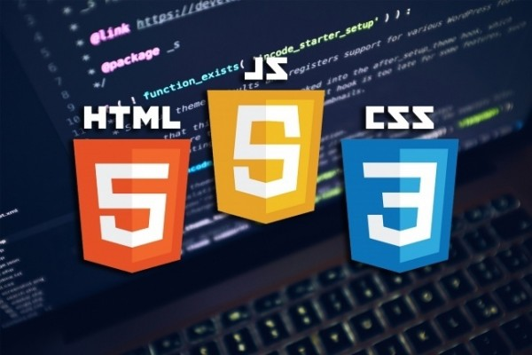
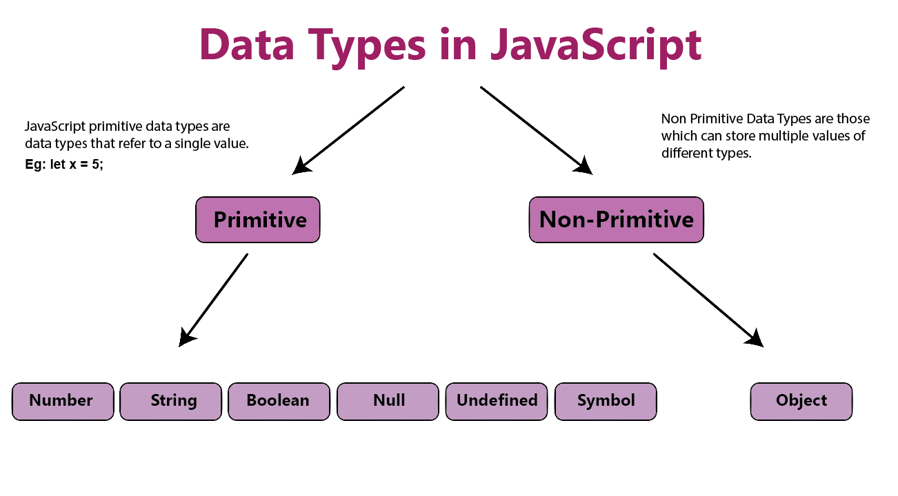

# JS_Lecture1

> Если вы видите этот пост, это
означает, что вы много
боролись и, наконец
, добились успеха

## Начало работы с javascript
> JavaScript is a popular programming
language that has a wide range of
applications.
JavaScript was previously used mainly for
making webpages interactive such as form
validation, animation, etc. Nowadays,
JavaScript is also used in many other areas
such as server-side development, mobile
app development and so on.
JavaScript - популярный
язык программирования, который имеет широкий спектр
применений.
Ранее JavaScript использовался в основном для
того, чтобы сделать веб-страницы интерактивными, такими как
проверка формы, анимация и т.д. В настоящее время
JavaScript также используется во многих других областях
, таких как разработка на стороне сервера, разработка мобильных
приложений и так далее.

## JavaScript также используется во многих других областях
- > Динамические эффекты и веб-приложения в браузере
- > Веб-приложения на веб-серверах
- > Собственные мобильные приложения
- > Собственные настольные приложения

##  РОЛЬ JAVASCRIPT В ВЕБ-РАЗРАБОТКЕ 
> 

## JAVASCRIPT RELEASES
> The ECMAScript specification is a standardized specification of a scripting
language developed by Brendan Eich of Netscape initially named Mocha, then
LiveScript, and finally JavaScript.
Learn modern JavaScript from the beginning, but without forgetting the older
parts!
Спецификация ECMAScript - это стандартизированная спецификация скриптового
языка, разработанного Бренданом Эйхом из Netscape, первоначально названного Mocha, затем
LiveScript и, наконец, JavaScript.
Изучайте современный JavaScript с самого начала, но не забывая о старых
частях!

### Благодаря широкому спектру приложений, вы можете запускать JavaScript несколькими способами
> 1) Использование вкладки консоли веб-браузеров
> 2) Используя Node.js
> 3) Путем создания веб-страниц

## Переменные и константы JavaScript
> В Javascript существует два типа инициализирующих переменных, var и let. Вы можете использовать их оба.
Однако между ними есть некоторые различия.
В программировании переменная - это контейнер (область хранения) для хранения данных.
Если вы уверены, что значение переменной не будет меняться на протяжении всей программы, рекомендуется
использовать const .
> 

## Операторы В JavaScript
> - Arithmetic
> - Comparison
> - Logical
> - Type Conversions
> - Assignment

## Conditions 
> 1) if/else
> 2) ternary operator
> 3) switch

## Lopps
> 1) for
> 2) while
> 3) do/while

## Functions
> 1) function declaration
> 

> 2) function Expression
> 

> 3) Immediately Invoked
Function Expression
(IIFE)
> 

> 
